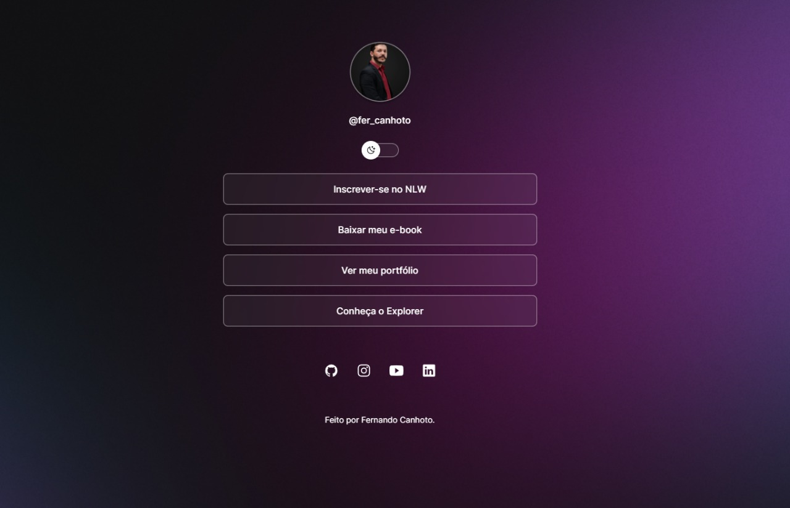

  <h1>Projeto Perfil Link</h1>

  

<h1>🚀 Tecnologias</h1>
  
Esse projeto foi desenvolvido com as seguintes tecnologias:

<lu>
  <li>HTML e CSS</li>
  <li>JavaScript</li>
  <li>Git e Github</li>
  <li>Figma</li>
</lu>

<h1>💻 Projeto</h1>
  
O Perfil Link é um agregador de links para usar como cartão de visitas online.

<h1>📝 Licença</h1>
  
Esse projeto está sob a licença MIT.

